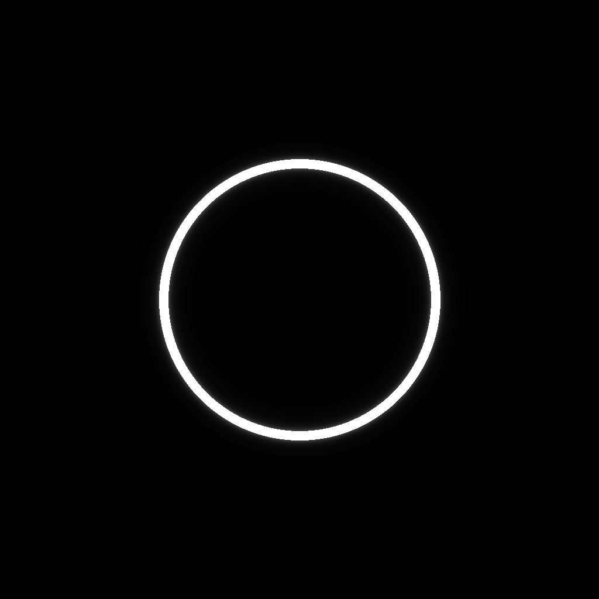
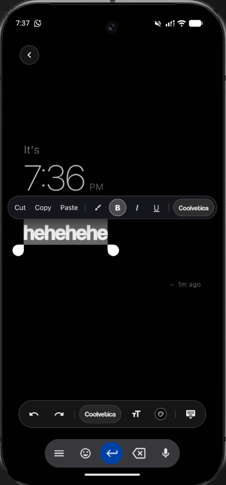
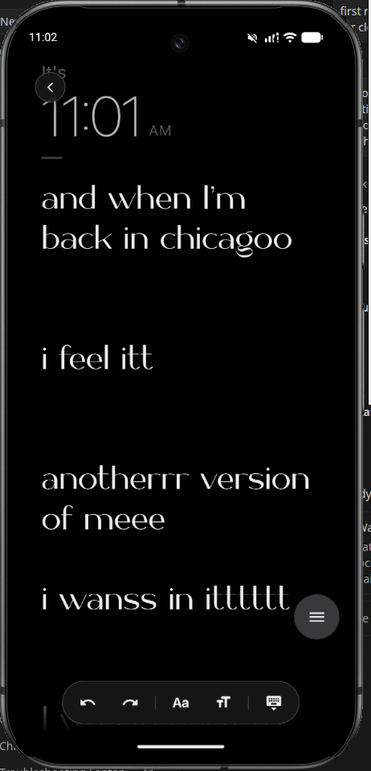
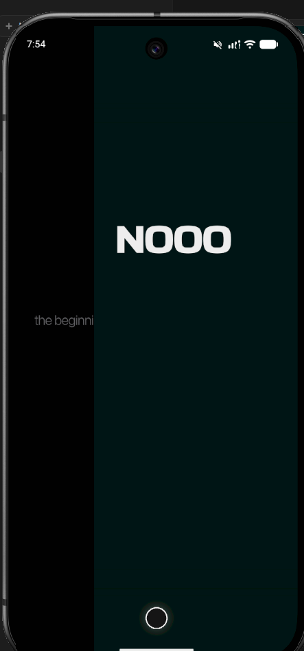
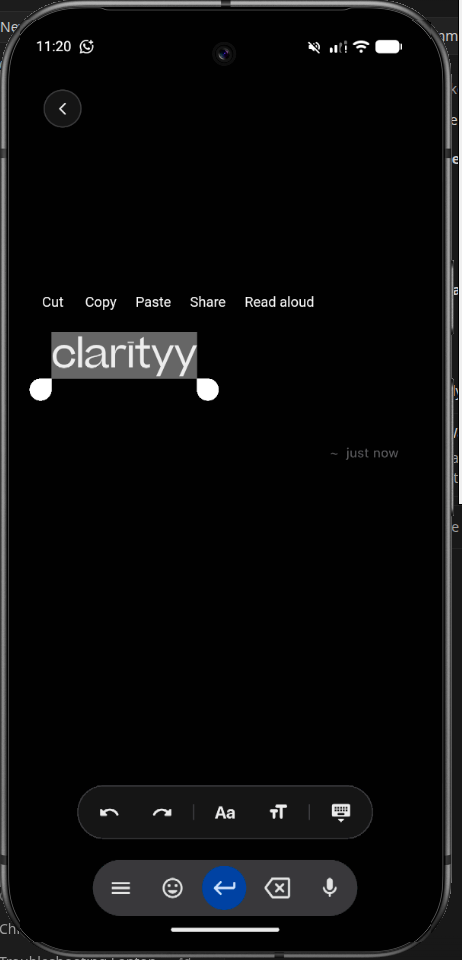
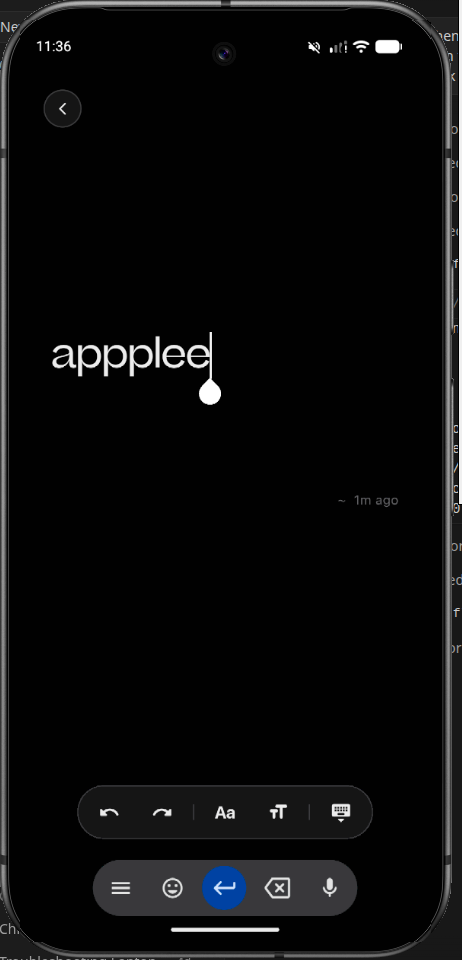

<div align="center">



# ✦ NULL ✦
### Pure Dark. Zero Friction. Just Your Thoughts.

An ultra-minimalist, pure dark notes and thinking sanctuary crafted with obsessive precision in Flutter.

[](https://flutter.dev)
[](https://dart.dev)
[](https://pub.dev/packages/hive)
[](LICENSE)

[Screenshots](#-visual-showcase) • [Features](#-key-features) • [Smart Typography](#-smart-words-formatting-engine) • [Architecture](#-architecture) • [Getting Started](#-getting-started) • [Privacy Policy](PRIVACY_POLICY.md) • [Author](#-author)

---

</div>

## 📱 Visual Showcase

<div align="center">

| Pure Dark Canvas | Selection Toolbar | Editorial Overscroll |
| :---: | :---: | :---: |
|  |  |  |
| *Immediate Blank Draft Canvas* | *Context Selection & Formatting Toolbar* | *270° Context-Aware Editorial Spine* |

<br/>

| Atmospheric Dark Palette | Multi-Note Horizontal Swiping |
| :---: | :---: |
|  |  |
| *Atmospheric Color Tints & Typo Cycles* | *Full-Height Independent Tab Columns* |

</div>

---

## 🌌 Philosophy & Essence

Most note-taking applications clutter your mind with complex menus, nested folders, syncing spinners, and distracting toolbars. **Null** strips away everything that is not your immediate thought:

- **Uncompromising Pitch-Black Canvas (`#000000`)**: Designed for midnight brain dumps, deep focus, and zero eye fatigue.
- **Immediate Action**: Opens directly to a clean empty draft editor by default—ready for your first keystroke.
- **Fluid Morphing Physics**: A minimalist glowing indicator circle that fluidly transforms into a floating editorial formatting toolbar.
- **100% Offline & Private**: Zero cloud sync, zero telemetry, zero accounts. Every word is saved in sub-millisecond local binary storage.

---

## ✨ Key Features

### 1. 🖋️ Smart Words Formatting Engine
Expressive emotions, Gen Z slang, and aesthetic expressions automatically format into bespoke typography as you type in real time:

| Category | Triggers & Examples | Typography & Style |
| :--- | :--- | :--- |
| **💖 Love & Affection** | `love`, `dear`, `heart`, `forever`, `adore`, `sweet`, `kiss`, `plea+se` | *`Aloevera` Italic Script with Soft Rose Blush (`0x44FF453A`)* |
| **⚡ Intensity & Drama** | `hate`, `rage`, `anger`, `never`, `burn`, `chaos`, `cooked`, `crying`, `down bad`, `noo+`, `bruh+` | *`BasementGrotesque` w900 Stark Ultra-Bold* |
| **💅 Gen Z Slang & Lore** | `fr`, `frfr`, `lowkey`, `highkey`, `ngl`, `tbh`, `delulu`, `rizz`, `aura`, `slay`, `valid`, `nocap`, `omg+` | *`Coolvetica` w600 with Soft Violet Glow (`0x44BF5AF2`)* |
| **💰 Wealth & Ambition** | `money`, `cash`, `wealth`, `rich`, `gold`, `empire`, `success`, `dollar`, `crypto`, `bag` | *`Futura` w600 with Soft Amber Gold Highlight (`0x44FFD60A`)* |
| **✨ Eras & Manifestation** | `era`, `main character`, `manifest`, `manifesting`, `healing`, `vibe`, `glow up`, `obsessed`, `literally`, `yess+` | *`Beatrice` Italic Bold (`w700`)* |
| **🐞 Miraculous & Fandom** | `marinette`, `adrien`, `cat noir`, `tikki`, `plagg`, `iyamatwm`, `spots on`, `claws out`, `miraculous` | *Parisian Ladybug Rose / Cat Noir Neon Lime Accents* |
| **🌌 Void & 3AM Solitude** | `dark`, `light`, `void`, `null`, `infinite`, `peace`, `breathe`, `sleep`, `dream`, `silence`, `3am`, `midnight`, `whyy+` | *`Agitha` Italic with Soft Sky Highlight (`0x4464D2FF`)* |
| **👤 Self & Identity** | `I`, `me`, `myself`, `you`, `we`, `people`, `human`, `soul`, `mind` | *`Beatrice` Bold (`w700`)* |

### 2. 🪄 Non-Destructive Selection Toolbar
- High-performance text interval slicing for word-level and selection-level formatting.
- Instant access to **Highlighting**, **Bold**, **Italic**, **Underline**, **Typeface Swapping**, and **Font Size Adjustments**.
- Manual selections always take 100% priority over smart defaults.

### 3. 🌀 Integrated Editorial Overscroll Reveals
- When overscrolling past the oldest note, an editorial vertical spine ($270^\circ$ rotated bold typography) reveals context-aware witty messages (`"aha no more stuff here"`, `"break the flow here bruhh"`).

### 4. ⚙️ Dark-Glass Settings & Preferences
- **Open to New Note vs Resume Note**: Choose whether to start fresh on launch or resume right where you left off.
- **Smart Words Styling Toggle**: Seamlessly toggle automatic smart word formatting ON or OFF.

---

## 🏗️ Architecture & Tech Stack

```
lib/
├── core/
│   ├── controllers/      # NullRichTextController (Interval slicing text builder)
│   ├── fonts/            # Custom typefaces (SF Pro, Beatrice, Aloevera, Coolvetica, etc.)
│   ├── models/           # Note, QuoteItem, SpanStyle models
│   ├── services/         # NotesService (Hive binary database & reactive state)
│   └── typography/       # SmartWordsEngine (Regex token matching & styling)
├── screens/
│   ├── editor/           # EditorScreen, EditorState
│   └── settings/         # SettingsScreen & Glass preference tiles
├── widgets/              # NullBottomDock, NullGlowingRing, NullSelectionContextMenu
└── main.dart             # NullUniversalShell, Lifecycle observer & routing
```

- **Framework**: Flutter 3.x (Dart 3.x)
- **Database**: Pure Dart [Hive](https://pub.dev/packages/hive) NoSQL Binary Storage
- **Typography Engine**: Bespoke multi-span controller running at 120fps with zero layout jank

---

## 🚀 Getting Started

### Prerequisites
- [Flutter SDK](https://flutter.dev/docs/get-started/install) (version 3.24.0 or higher)
- Android Studio / VS Code / Xcode

### Installation
```bash
# Clone the repository
git clone https://github.com/GauravGadhari/null-notes.git
cd null-notes

# Install dependencies
flutter pub get

# Run test suite
flutter test

# Launch on your device or emulator
flutter run
```

---

## 📁 Screenshots Archive

All high-resolution application screenshots are archived inside the [`screenshots/`](screenshots/) directory:
- [`screenshots/hero_canvas.png`](screenshots/hero_canvas.png) — Editor canvas & live time prompt
- [`screenshots/selection_toolbar.png`](screenshots/selection_toolbar.png) — Selection context menu & bottom formatting dock
- [`screenshots/overscroll_spine.png`](screenshots/overscroll_spine.png) — 270° rotated editorial overscroll spine
- [`screenshots/dark_atmosphere.png`](screenshots/dark_atmosphere.png) — Atmospheric dark color swatches
- [`screenshots/multi_page_editor.png`](screenshots/multi_page_editor.png) — Tab navigation & note stack
- [`screenshots/app_icon.png`](screenshots/app_icon.png) — Minimalist glyph app icon

---

## 🔒 Privacy & Security

Null is built with privacy at its core:
- **Zero Data Collection**: No personal information, note text, or device telemetry is ever collected.
- **100% Offline**: Operates completely disconnected from the internet.
- Read the full [Privacy Policy](PRIVACY_POLICY.md).

---

## 👤 Author

**Gaurav Gadhari**
*Visionary Developer, AI Architect & Next-Gen Software Pioneer*

- **Website**: [gaurav-gadhari.vercel.app](https://gaurav-gadhari.vercel.app)
- **GitHub**: [@GauravGadhari](https://github.com/GauravGadhari)
- **LinkedIn**: [Gaurav Gadhari](https://www.linkedin.com/in/gaurav-gadhari-579558275/)
- **Twitter / X**: [@AGauravHere](https://x.com/AGauravHere)
- **Instagram**: [@a_gaurav_here](https://www.instagram.com/a_gaurav_here/)
- **YouTube**: [@codewithgaurav37](https://www.youtube.com/@codewithgaurav37)
- **Email**: [gauravgadhari39@gmail.com](mailto:gauravgadhari39@gmail.com)

---

## 📄 License

This project is licensed under the MIT License - see the [LICENSE](LICENSE) file for details.
